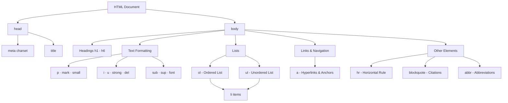

# Projeto HTML Basico - Trilha HTML DIO

<div align="center">


</div>

## Imagem Hero


---


Este projeto foi desenvolvido como parte da **Trilha de HTML** da DIO. O objetivo foi praticar os conceitos fundamentais de HTML, construindo um website simples com diversas tags aprendidas durante as aulas.

A ideia foi criar uma **estrutura básica de site**, aplicando todas as tags vistas na prática, além de pesquisar e usar algumas novas para expandir o conhecimento.

---

# 🌐 Basic HTML Project – DIO HTML Track

This project was developed as part of DIO's **HTML Track**. The goal was to practice fundamental HTML concepts by building a simple website with various tags learned during the lessons.

The idea was to create a **basic site structure**, applying all the tags seen in practice, as well as researching and using some new ones to expand knowledge.

---

## 🧠 Objetivo

O desafio consistiu em:

✅ Criar um website simples e bem estruturado  
✅ Utilizar todas as principais tags aprendidas no curso  
✅ Pesquisar e aplicar novas tags sugeridas  
✅ Publicar o projeto em um repositório no GitHub

---

## 🧠 Objective

The challenge consisted of:

✅ Creating a simple and well-structured website
✅ Using all the main tags learned in the course
✅ Researching and applying new suggested tags
✅ Publishing the project in a GitHub repository

---

## 🛠️ Tecnologias e Ferramentas

- HTML5
- Editor de código (VS Code recomendado)
- Navegador web
- Git e GitHub

---

## 🛠️ Technologies and Tools

- HTML5
- Code editor (VS Code recommended)
- Web browser
- Git and GitHub

---

## 🏗️ Estrutura do Projeto

O projeto utiliza uma série de **tags HTML** para estruturar e organizar o conteúdo da página. Veja abaixo as principais utilizadas:

### ✍️ Tags de texto e formatação:

- `<h1>` até `<h6>`: títulos de diferentes níveis
- `<p>`: parágrafos
- `<mark>`: destaca uma palavra
- `<small>`: texto com tamanho reduzido
- `<i>`: texto em itálico
- `<u>`: sublinhado
- `<strong>`: negrito
- `<del>`: texto riscado
- `<font>`: muda a cor do texto (tag obsoleta, usada aqui para aprendizado)

---

## 🏗️ Project Structure

The project uses a series of **HTML tags** to structure and organize the page content. See below for the main ones used:

### ✍️ Text and formatting tags:

- `<h1>` to `<h6>`: different level headings
- `<p>`: paragraphs
- `<mark>`: highlights a word
- `<small>`: reduced size text
- `<i>`: italic text
- `<u>`: underlined
- `<strong>`: bold
- `<del>`: strikethrough text
- `<font>`: changes text color (obsolete tag, used here for learning purposes)


### 🧾 Listas:

- `<ol>`: lista ordenada
- `<ul>`: lista não ordenada
- `<li>`: itens de lista

---

### 🧾 Lists:

- `<ol>`: ordered list
- `<ul>`: unordered list
- `<li>`: list items

### 🌐 Links e navegação:

- `<a>`: âncoras e hyperlinks

---

### 🌐 Links and navigation:

- `<a>`: anchors and hyperlinks

### 🧪 Outros elementos:

- `<hr>`: linha horizontal
- `<sub>`: subscrito (ex: fórmulas químicas como H₂O)
- `<sup>`: sobrescrito (ex: potências como 2¹⁰)
- `<blockquote>`: citações em bloco
- `<abbr>`: abreviações com significado visível ao passar o mouse

---

### 🧪 Other elements:

- `<hr>`: horizontal line
- `<sub>`: subscript (e.g., chemical formulas like H₂O)
- `<sup>`: superscript (e.g., powers like 2¹⁰)
- `<blockquote>`: blockquotes
- `<abbr>`: abbreviations with visible meaning on hover

---

## 🏗️ Hierarquia das Tags HTML / HTML Tags Hierarchy



---

## 💡 Exemplo de Código

---

## 💡 Code Example

```html
<!DOCTYPE html>
<html lang="pt-br">
<head>
  <meta charset="UTF-8">
  <title>Projeto HTML Básico</title>
</head>
<body>

  <h1>Bem-vindo ao Meu Website</h1>
  <h2>Este é um subtítulo nível 2</h2>
  <h3>Subtítulo nível 3</h3>
  <h4>Subtítulo nível 4</h4>
  <h5>Subtítulo nível 5</h5>
  <h6>Subtítulo nível 6</h6>

  <p>Este é um parágrafo com uma palavra <mark>destacada</mark>.</p>
  <p>Texto com <i>itálico</i>, <u>sublinhado</u>, <strong>negrito</strong> e <small>pequeno</small>.</p>

  <hr>

  <p>Lista ordenada:</p>
  <ol>
    <li>HTML</li>
    <li>CSS</li>
    <li>JavaScript</li>
  </ol>

  <p>Lista não ordenada:</p>
  <ul>
    <li>Ler</li>
    <li>Jogar</li>
    <li>Estudar</li>
  </ul>

  <p>Visite a <a href="https://dio.me" target="_blank">DIO</a></p>

  <p>Fórmula da água: H<sub>2</sub>O</p>
  <p>2<sup>10</sup> = 1024</p>

  <blockquote>
    "A simplicidade é o último grau de sofisticação." – Leonardo da Vinci
  </blockquote>

  <p><font color="blue">Texto com a tag font (obsoleta, usada para fins didáticos).</font></p>
  <p>Este texto foi <del>riscado</del> com a tag del.</p>
  <p>Exemplo de abreviação: <abbr title="HyperText Markup Language">HTML</abbr></p>

</body>
</html>


## 📦 Instalação / Installation

Clone o repositório e abra o arquivo `index.html` diretamente no navegador — nenhuma instalação adicional é necessária.

Clone the repository and open `index.html` directly in your browser — no additional installation required.

```bash
git clone https://github.com/galafis/Criar-Uma-Pagina-Web-Utilizando-as-Tags-Aprendidas.git
```

## 📄 Licença / License

Este projeto está licenciado sob a Licença MIT.
This project is licensed under the MIT License.

---

## ✒️ Autor

**Gabriel Demetrios Lafis**

---

## ✒️ Author

**Gabriel Demetrios Lafis**


---

## English

### Overview

Projeto HTML Basico - Trilha HTML DIO - A project built with JavaScript, HTML, CSS, developed by Gabriel Demetrios Lafis as part of professional portfolio and continuous learning in Data Science and Software Engineering.

### Key Features

This project demonstrates practical application of modern development concepts including clean code architecture, responsive design patterns, and industry-standard best practices. The implementation showcases real-world problem solving with production-ready code quality.

### How to Run

1. Clone the repository:
   ```bash
   git clone https://github.com/galafis/Criar-Uma-Pagina-Web-Utilizando-as-Tags-Aprendidas.git
   ```
2. Follow the setup instructions in the Portuguese section above.

### License

This project is licensed under the MIT License. See the [LICENSE](LICENSE) file for details.

---

Developed by [Gabriel Demetrios Lafis](https://github.com/galafis)
